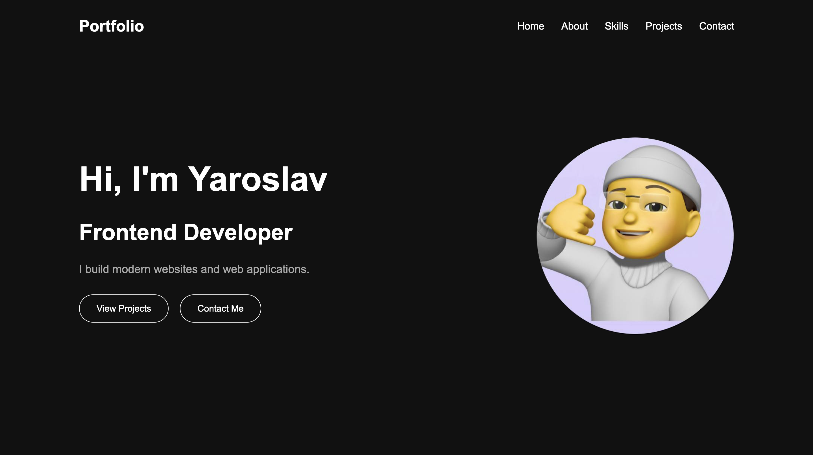
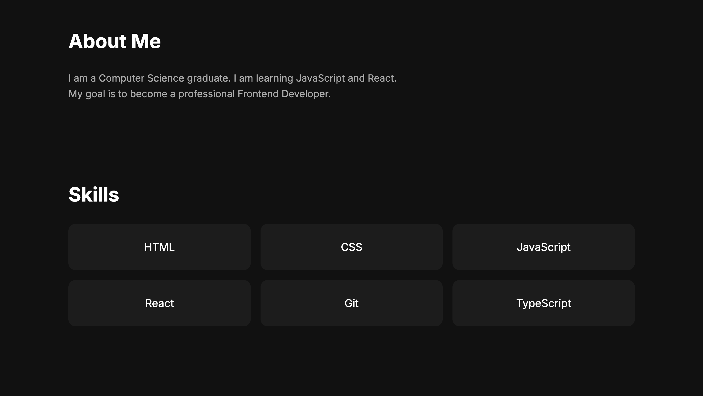
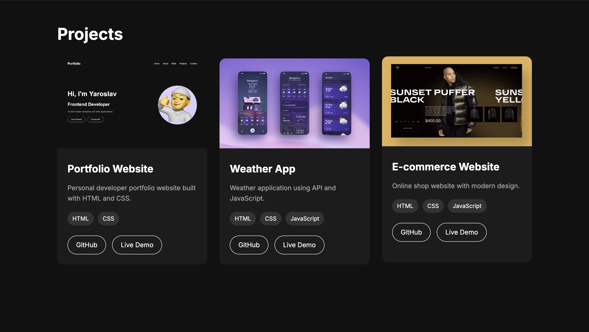
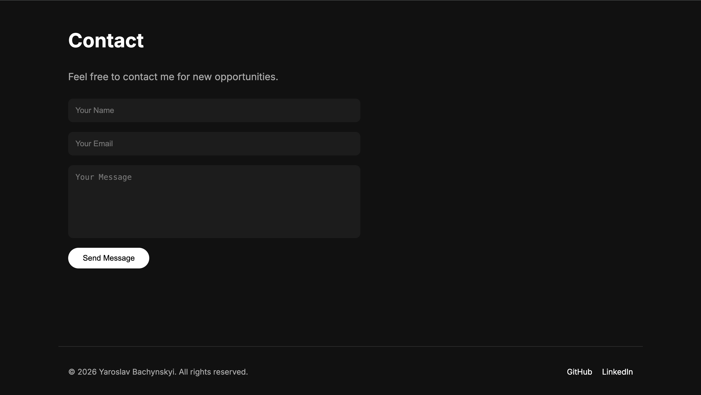

# Personal Portfolio Website

A modern personal portfolio website built with HTML and CSS.

This project represents my first step into Frontend Development and showcases my skills, projects, and contact information.

## 🚀 Demo

Live Demo: Coming soon

## 📌 About The Project

This is my personal developer portfolio website.

The goal of this project was to practice and improve my skills in:

- Semantic HTML structure
- Modern CSS layout
- Flexbox
- CSS Grid
- Responsive Design
- Git and GitHub workflow

The website includes information about me, my skills, projects, and contact form.

## 🛠 Technologies

Technologies used in this project:

- HTML5
- CSS3
- Flexbox
- CSS Grid
- Responsive Design
- Google Fonts (Inter)
- Git / GitHub

## ✨ Features

- Dark modern design
- Responsive layout for desktop, tablet, and mobile devices
- Hero section with personal introduction
- About Me section
- Skills section
- Projects cards
- Contact form
- Footer with social links

## 📂 Project Structure

```
portfolio-website/

├── index.html

├── style.css

├── images
 └── readme
      ├── profile1.png
      ├── profile2.png
      ├── profile3.png
      └── profile4.png

└── README.md
```

## 🎯 Future Improvements

In the future I plan to add:

- JavaScript animations
- Mobile navigation menu
- Form validation
- More projects
- React version of this portfolio

## 📸 Screenshot

### Home Page




### Projects Section




### Skills Section




### Contact Section




## 👨‍💻 Author

Yaroslav Bachynskyi

GitHub:
https://github.com/Yarko098

LinkedIn:
Coming soon


---

⭐ Thanks for checking out my project!